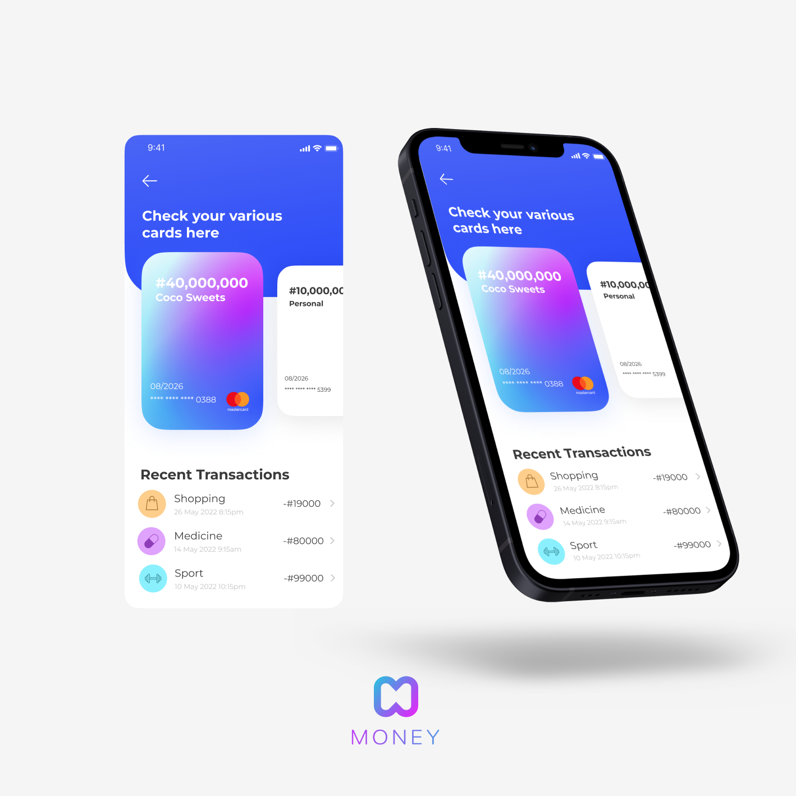

# React Js Banking App
**View project live [HERE](https://money-by-korede.netlify.app)!**

The MONEY app is a mobile banking application, rendered as a React web application.

[UI design by Oshode Similoluwa](https://www.figma.com/file/s0jKMlulu7vx3RVgwGSWIk/Untitled?node-id=0%3A1)

#

## **Features**
• Onboarding (Sign In / Sign Up)

• OTP Verification (Demo)

• Instant money transfer

• Debit cards

• Savings and Expenses Overview

• Balance Summary

• Notifications History

• Profile View

#

**This project was bootstrapped with:**

• [Create React App](https://github.com/facebook/create-react-app)

• [React Router](https://reactrouter.com)

• [Bootstrap CSS](https://getbootstrap.com)

• [Sass](https://sass-lang.com)